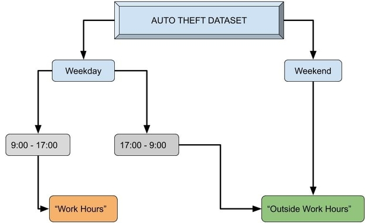

---
output:
  ioslides_presentation: default
  widescreen: yes
---

```{r, echo=FALSE, message=FALSE, warning=FALSE}
# echo=FALSE will stop the code chunk from appearing in the knit document
# warning=FALSE and message=FALSE will stop R messages from appearing in the knit document
library(tidyverse)
```

```{r, echo=FALSE, message=FALSE, warning=FALSE}
data <- read.csv("auto_thefts.csv")

data_1 <- data %>%
  select(Index_, reporteddayofyear, occurrencedayofyear, occurrencedayofweek, reportedyear, occurrenceyear, reportedhour, occurrencehour, reporteddayofweek) %>%   filter(!is.na(occurrencehour)) %>% filter(!is.na(reportedhour)) %>% filter(!is.na(reportedyear)) %>% filter(!is.na(occurrenceyear)) %>% filter(!is.na(reporteddayofweek)) %>%
  mutate(work_category = ifelse(occurrencehour < 9 | occurrencehour > 17 | reporteddayofweek == "Saturday    " | reporteddayofweek == "Sunday    ", yes = "Outside Work Hours", no = "Work Hours")) %>%  
  mutate(reporttime = ((reportedyear - 2000) * 8760 + reporteddayofyear * 24  + reportedhour) -
((occurrenceyear - 2000) * 8760 + occurrencedayofyear * 24 + occurrencehour))

#Null Hypothesis Simulation
set.seed(102)
repetitions <- 10000
simulated_differences <- rep(NA, times=repetitions)

for(i in 1:repetitions){
  value <- data_1 %>% 
    mutate(work_category=sample(work_category)) %>%
    group_by(work_category) %>%
    summarise(means = mean(reporttime)) %>%
    summarise(diff(means)) %>%
    as.numeric()
  
  simulated_differences[i] <- value
}
```

```{r, echo = FALSE, warning = FALSE, message = FALSE}
#Confidence Interval
set.seed(102)
boot_means <- rep(NA, 5000) # where we'll store the means 

for(i in 1:5000){
  boot_samp <- data_1 %>% sample_n(size=18175, replace=TRUE) 
  boot_means[i] <- 
    as.numeric(boot_samp %>% group_by(work_category) %>% 
                 summarise(means = mean(reporttime)) %>% 
                 summarise(abs(diff(means))) %>% 
                 as.numeric())
                              
}

boot_means <- data_frame(mean_time = boot_means)
```


---
title: "Report Times of Toronto Auto Thefts"
subtitle: During Work Hours vs Outside Work Hours
author: "Neeco Fabian, Charles Wang, Kevin Zhao, TUT 0209, 209-4"
---

## The Problem
The Insurance Bureau of Canada highlights key reasons why cars are stolen$^1$:

1. Dismantling for parts
2. Sold abroad
3. Used for other crimes
\
\
These usually happen within 48 hours after the theft.\
\
Longer report times $\implies$ less likely to retrieve car.\

\
<center>**Reduce auto thefts, reduce other crimes.**</center>

## Objectives
* Analyze auto theft data from the Toronto Police Service
* Find interesting relationships between the factors of each theft
* Use our research to propose suggestions to help the Toronto Police Services to aid the recovery of stolen vehicles

## Introduction
* Research based on 18,178 auto thefts in Toronto gathered from 2000 to 2018 reported to the Toronto Police Service.
\
\
* Investigated factors that may influence the time it takes for an auto theft to be reported.
\
\
* We considered the time at which a vehicle was stolen:

## Initial Observations I
```{r, echo = FALSE}

data_obs_1 <- data_1 %>% mutate(cat_hour = ifelse(occurrencehour >= 16, yes = "16-23", ifelse(occurrencehour >= 0 & occurrencehour < 8, yes = "0-8", "8-16"))) %>% filter(reporttime < 48) 

data_obs_1$cat_hour <- factor(data_obs_1$cat_hour, levels = c("16-23", "8-16", "0-8"))

data_obs_1 %>% ggplot(aes(x = cat_hour, y = reporttime)) + geom_boxplot(color = "black", fill = "cornflowerblue") + labs(y = "Time Taken to Report Theft", x = "Hour Intervals in a Day") + coord_flip() 
```
Observing if a third of the day has longer average time taken to report theft.

## Initial Observations II
```{r, echo = FALSE, message = FALSE}


data_obs_2 <- data_1 %>% mutate(cat_week = ifelse(occurrencedayofweek == "Monday    ", yes = "Monday", ifelse(occurrencedayofweek == "Tuesday   ", yes = "Tuesday", ifelse(occurrencedayofweek == "Wednesday ", yes = "Wednesday", ifelse(occurrencedayofweek == "Thursday  ", yes = "Thursday", ifelse(occurrencedayofweek == "Friday    ", yes = "Friday", ifelse(occurrencedayofweek == "Saturday  ", yes = "Saturday", "Sunday"))))))) %>% filter(reporttime < 48) 

data_obs_2$cat_week <- factor(data_obs_2$cat_week, levels = c("Sunday", "Saturday", "Friday", "Thursday", "Wednesday", "Tuesday", "Monday"))

data_obs_2 %>% 
  ggplot(aes(x = cat_week, y = reporttime)) + geom_boxplot(color = "black", fill = "cornflowerblue") + labs(y = "Time Taken to Report Theft", x = "Type of Day") + coord_flip()
```
Stronger right skew on Friday, Saturday, Sunday\
$\implies$ Longer mean time taken to report theft.

## The Research Question

**What is the relationship between the report times of vehicles stolen during typical work hours and outside those hours?**
\
\
\
**Report Time** - number of hours taken for an auto theft to be reported to the Toronto Police Service
\

\
**Working Hours** - typical work hours, (9:00 - 17:00) on weekdays


## Data Wrangling I
<center>**report time = reported hour - occurred hour**</center>
\
- calculated by the difference between the hour the car was reported stolen and the hour the car was stolen.\
\
- dependent variable in study

## Data Wrangling II
<center> Split data into cars stolen during work hours or otherwise </center>

 


## Data Observations
```{r, echo = FALSE}
test_stat1 <- data_1 %>%
  group_by(work_category) %>% summarise("Mean Report Times" = mean(reporttime))


test_stat1
```
Mean report time during work hours is about 272 hours, and outside work hours is 115 hours.\
\
This *suggests* that cars stolen during work hours take longer to be reported stolen on average in Toronto.

## The Test Statistic
The mean difference of report times in and outside work hours in the TPS dataset:

```{r, echo = FALSE}
test_stat <- data_1 %>%
  group_by(work_category) %>% summarise(means = mean(reporttime)) %>% summarise(abs(diff(means))) %>% as.numeric()

test_stat
```

* About 157 hours

## Statistical Methods
**Step 1: Two-sided Hypothesis Test**
\
**Purpose:** to analyze the difference between report times during work hours and outside work hours\

\
\
**Step 2: Confidence Interval**
\
**Purpose:** to develop an interval at which we are 95% confident that the true difference between the mean report times during work hours and outside work hours is in\


## The Hypothesis Test
**Null Hypothesis:**
The mean time for an auto-theft to be reported in Toronto is **equal** if the theft occurs during work hours or outside work hours.
\
\
**Alternative Hypothesis:**
The mean time for an auto-theft to be reported in Toronto is **not equal** if the theft occurs during work hours or outside work hours.
\
\
\
Run test using 10,000 simulations, and a significance level of 5%

## Results of Hypothesis Test
```{r, echo = FALSE}
#Histogram of simulated statistics under the null hypothesis
data_frame(simulated_differences) %>%
  ggplot(aes(x=simulated_differences)) + ggtitle("Estimated Sampling Distribution for Simulated Differences") + 
  geom_histogram(bins = 30, colour="black", fill = "aquamarine3") +
  geom_vline(xintercept = test_stat, color = "red") + geom_vline(xintercept = -(test_stat), color = "red") + labs(x = "Simulated Test Statistics")
```

## P-Value Interpretation
```{r, echo = FALSE}
# Calculate pvalues
data_frame(simulated_differences) %>%
  filter(simulated_differences >= abs(test_stat)  | 
           simulated_differences <= -abs(test_stat)) %>%
  summarise(pvalue = n() / repetitions)
```
* Represents probability of obtaining an observation as or more extreme as 157 hours
* P-Value is < 0.001; strong evidence against the null hypothesis
* P-Value is < 0.05; reject the null hypothesis
* 0.01% chance of making a Type 1 Error (rejecting the null hypothesis when it is true)

## Hypothesis Test to Confidence Interval
* Thus, we have strong evidence against the null hypothesis (and reject it)
\
* Next, we conduct a confidence interval to form new insight on the difference between mean report times

## Confidence Interval Context & Reasoning
* Generate random bootstrap samples of the same size as the dataset\
\
* Calculate the difference in mean report times during and outside work hours for each bootstrap sample \
\
* Find an interval that may contain the true difference between mean report times

## Confidence Interval Results I
```{r, echo = FALSE}
#plot
left_line = quantile(boot_means$mean_time, c(0.025))
right_line = quantile(boot_means$mean_time, c(0.975))
ggplot(boot_means, aes(x=mean_time)) + geom_histogram(bins = 20, fill="cadetblue", color="black") + geom_vline(xintercept = c(left_line, right_line), color = "red") + labs(x="Difference of Report Times (work hours - outside work hours) from Bootstrap Samples",
title="Bootstrap Sampling Distribution for Mean Difference of Report Times")

```

## Confidence Interval Results II
```{r, echo = FALSE}
quantile(boot_means$mean_time, c(0.025, 0.975))
```
* Confidence interval: (79.54, 247.25)
* 95% confident that the true difference of report times lies within this interval \
* Since 0 is not in this interval, we have more evidence against our null hypothesis \

## Limitations
* 95% confidence does not imply 95% probability
* Assumes that work hours for everyone is 9am - 5pm on weekdays
* Only based off of the Toronto Police Service Data; may not be applicable everywhere 

## Conclusion
<centre> We suggest that the Toronto Police Service </centre> \
\
\
- Educate the public on the importance of a quick report time \
\
- Expand neighbourhood watch programs for vehicles \
\
- Invest more police resources during work hours
\

## Acknowledgements
The authors would like to thank Daphne Choi and Nicholas Martin. The former for an understanding of the issue, and the latter for suggestions and comments that were pivotal in the creation of the project.\

## Sources
1: http://www.ibc.ca/on/auto/theft/top-ten-stolen-cars


